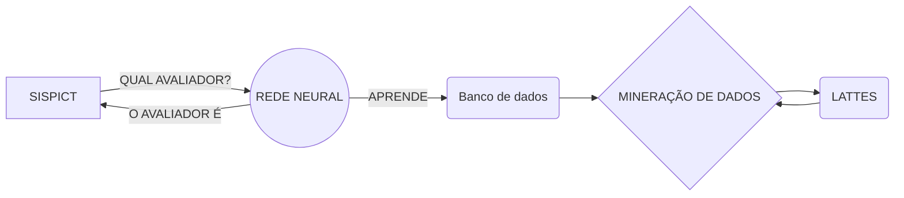

# Lanx

Desenvolvimento de um API python utilizando flask com inteligência artificial. O intuito é desenvolver uma rede neural, onde ela poderá avaliar o perfil dos professores e indicar o melhor professor para avaliar um determinado projeto, tendo em vista as habilidades do mesmo e o tema do projeto.

###  PRÉ-REQUISITO

 - Docker
 - Docker-compose

# PROBLEMA

Atualmente o há um sistema de inscrições de alunos em editais do CNPQ, onde o aluno concorrerá a uma bolsa e não havendo necessidade de ser totalmente ligada a área em que o aluno estuda, podendo ser temas interdisciplinares. No momento a assessora que cuida das bolsas escolhe manualmente o professor que irá avaliar, muitas das vezes não conseguindo traçar de forma eficiente o perfil daquele professor comparando ao tema daquele projeto inscrito, tendo em vista que poderá acarretar em avaliações sem qualidade, pois um professor sem conhecimento naquele assunto avaliando um trabalho que muitas das vezes fugirá ao entendimento do mesmo por ter muitos termos técnicos.
Não sabemos se ouve avaliações em que o projeto não passou pela falta de conhecimento do avaliador, mas desejamos tornar esse processo eficiente e eficaz.

## SOLUÇÃO

Desejamos criar um robô que converse com o sistema já construído. Podemos fazer uma mineração de dados do **Lates** sistema onde todos os professores são obrigados a manterem seus currículos atualizados e o que dará uma confiabilidade aos dados coletados. Desejamos criar um robô que a cada 3 meses ele atualize os dados lá inseridos e crie um banco com uma quantidade considerável de dados.
Utilizaremos o conceito de data science, como dito no [Link](https://www.cetax.com.br/blog/data-science/) faremos mineração dos dados do Lattes e criaremos uma base dados com todas as informações em um banco de dados próprio.
O processo de coleta será feita de tempos em tempos e com esses dados poderemos treinar uma rede neural para retornar o perfil mais adequado para avaliar determinado projeto.

## FLUXO DO PROJETO

